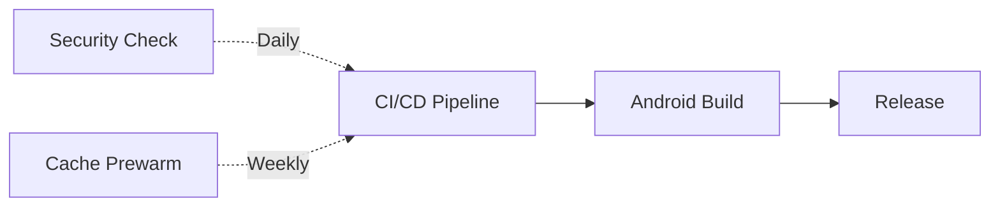

# GitHub Workflows Documentation

This directory contains documentation for all CI/CD workflows in this repository. Each workflow is documented in its own file with detailed information about triggers, dependencies, and outputs.

## Quick Reference

| Workflow | File | Trigger | Purpose |
|----------|------|---------|---------|
| **CI/CD Pipeline** | [ci-cd.md](./ci-cd.md) | Push to `main`/`dev`, PRs | Lint, typecheck, test, and build web app |
| **Android Build** | [android-build.md](./android-build.md) | After CI passes | Build signed release APK |
| **Release** | [release.md](./release.md) | Semver tags (`v*.*.*`) | Create GitHub releases with APK |
| **Cache Prewarm** | [prewarm.md](./prewarm.md) | Weekly, manual | Warm dependency caches |
| **Branch Cleanup** | [branch-cleanup.md](./branch-cleanup.md) | PR close, weekly | Clean up merged/stale branches |
| **Security Check** | [security-check.md](./security-check.md) | Daily | Scan for dependency vulnerabilities |

## Workflow Dependencies

The Android build depends on CI/CD completing successfully. Releases depend on Android builds completing successfully.

## Getting Started

1. **Before pushing code**: Review [ci-cd.md](./ci-cd.md) to understand what checks will run
2. **Before tagging a release**: Review [release.md](./release.md) and [android-build.md](./android-build.md)
3. **If builds fail**: Check the relevant doc for troubleshooting steps
4. **For security alerts**: See [security-check.md](./security-check.md)

## Required Secrets

The following repository secrets must be configured for workflows to function:

| Secret | Used By | Description |
|--------|---------|-------------|
| `ANDROID_KEYSTORE_BASE64` | Android Build | Base64-encoded keystore file |
| `ANDROID_KEYSTORE_PASSWORD` | Android Build | Keystore password |
| `ANDROID_KEY_ALIAS` | Android Build | Key alias name |
| `ANDROID_KEY_ALIAS_PASSWORD` | Android Build | Key alias password |

## Common Issues

- **Android build not running**: Check if CI/CD pipeline passed first
- **Release not created**: Verify tag format matches `v*.*.*` pattern
- **Missing artifacts**: Check if prerequisite workflows completed successfully
- **Failed security scan**: Review and update vulnerable dependencies

## Contributing

When modifying workflows:

1. Update the corresponding documentation file
2. Test changes on a feature branch before merging to `main`
3. Ensure all required secrets are documented
4. Update this README if adding/removing workflows

## Additional Resources

- [PWA Configuration](./pwa.md) - Progressive Web App setup and requirements
- [GitHub Actions Documentation](https://docs.github.com/en/actions)